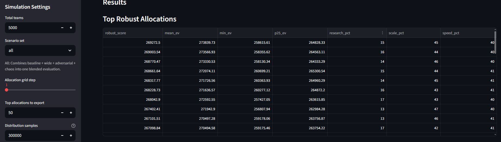
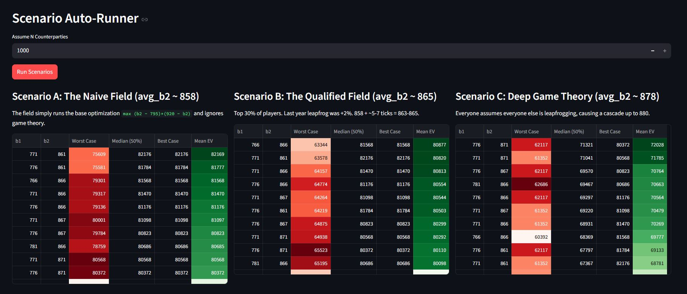

# IMC Prosperity 4 — 16th Place Writeup

IMC's Prosperity competition is a globally renowned quant trading competition where university students battle it out over 5 rounds of algorithmic trading for a chance at $50,000's in prize money. Prosperity tests its competitors on topics ranging from basic market making to complex basket arbitration.

This year's Prosperity 4 had over 30,000 students, or roughly 18,800 teams from 117 countries register to compete. The following writeup shares our insights and strategies that got us 16th out of 18,803 teams in IMC's Prosperity 4 (2026).

## The Team

<table width="100%">
  <tbody>
    <tr>
      <td align="center" valign="top" width="33%">
        <a href="https://www.linkedin.com/in/paytonguffey/">
          
           
          <b>Payton Guffey</b> 
          Algorithmic Trading Focused
        </a>
      </td>
      <td align="center" valign="top" width="33%">
        <a href="https://www.linkedin.com/in/gage-weaver/">
          
           
          <b>Gage Weaver</b> 
          Manual Trading Focused
        </a>
      </td>
      <td align="center" valign="top" width="33%">
        <a href="https://www.linkedin.com/in/j-owen-peel/">
          
           
          <b>Owen Peel</b> 
          Mental + Moral Support
        </a>
      </td>
    </tr>
  </tbody>
</table>

---

## Table of Contents

- [The Team](#the-team)
- [Results at a Glance](#results-at-a-glance)
- [Backtesting & Infrastructure](#backtesting--infrastructure)
- [Phase 1: Qualifying (Rounds 1–2)](#phase-1-qualifying-rounds-12)
  - [Round 1: Algorithmic Trading](#round-1-algorithmic-trading)
  - [Round 1: Manual Trading](#round-1-manual-trading)
  - [Round 2: Algorithmic Trading](#round-2-algorithmic-trading)
  - [Round 2: Manual Trading](#round-2-manual-trading)
- [Phase 2: Finals (Rounds 3–5)](#phase-2-finals-rounds-35)
  - [Round 3: Algorithmic Trading](#round-3-algorithmic-trading)
  - [Round 3: Manual Trading](#round-3-manual-trading)
  - [Round 4: Algorithmic Trading](#round-4-algorithmic-trading)
  - [Round 4: Manual Trading](#round-4-manual-trading)
  - [Round 5: Algorithmic Trading](#round-5-algorithmic-trading)
  - [Round 5: Manual Trading](#round-5-manual-trading)
- [Synthetic Data Testing](#synthetic-data-testing)
- [Resources & Tools](#resources--tools)

---

## Results at a Glance

<table width="100%">
  <thead>
    <tr>
      <th>Checkpoint</th>
      <th>Rank</th>
      <th>Overall PnL</th>
      <th>Manual</th>
      <th>Algo</th>
    </tr>
  </thead>
  <tbody>
    <tr>
      <td>Round 1</td>
      <td>801</td>
      <td>185,698</td>
      <td>87,995</td>
      <td>97,703</td>
    </tr>
    <tr>
      <td>Round 2 (Phase 1 Final)</td>
      <td>92</td>
      <td>498,216</td>
      <td>305,865</td>
      <td>192,351</td>
    </tr>
    <tr>
      <td>Round 3</td>
      <td>255</td>
      <td>181,482</td>
      <td>79,622</td>
      <td>101,860</td>
    </tr>
    <tr>
      <td>Round 4</td>
      <td>149</td>
      <td>395,575</td>
      <td>103,188</td>
      <td>292,387</td>
    </tr>
    <tr>
      <td><b>Round 5 (Phase 2 Final)</b></td>
      <td><b>16</b></td>
      <td><b>1,004,425</b></td>
      <td><b>152,841</b></td>
      <td><b>851,583</b></td>
    </tr>
  </tbody>
</table>

## Backtesting & Infrastructure

We primarily used Kevin Fu's adaptation of Jmerle's Prosperity 3 backtester alongside the Official IMC Portal. We found that Kevin Fu's backtester worked well for us because of its flexibility. We took advantage of this by customizing fill behavior, testing on specific day segments, and adding our own synthetic data to the testing pool.

For a full breakdown please refer to the Backtesting section (Coming Soon) or [Synthetic Data Testing](#synthetic-data-testing) section.

For dashboards, we ended up making our own during the tutorial round and added features as we went. Initially, it was designed around looking for repetitive patterns from writeups of Prosperity 1, 2, and 3, like inside traders, and potential statistical arbitrages. However, due to the major changes in this year's competition, the visualizer had to be updated constantly.

I plan on polishing it up and releasing it open source this summer.

---

## Phase 1: Qualifying (Rounds 1–2)

Phase 1 consisted of Rounds 1 and 2 and acted as a qualifier. Across all of these rounds 2 products were traded. The goal was to reach 200,000 XIREC before the leaderboard reset for Phase 2.

### Round 1: Algorithmic Trading

---

#### Intarian Pepper Roots

The first tradable good was Intarian Pepper Roots. If you had looked at writeups from Prosperity 3, 2, and 1, you could have expected a product similar to this. The product followed a tight upward trend with a handful of slightly mispriced orders from the bots. The optimal strategy here was to follow the upward trend and immediately max your position limit, then scalp sell any buy orders that were above fair market value and rebuy immediately at fair market value. The bots had good enough liquidity that your orders at FMV would get filled near immediately.

That being said, the discord channel had a handful of trolls and with this being my first trading competition I partially fell victim to their propaganda on The Great Intarian Pepper Root Crash. So I spent a huge chunk of time creating a regime switching strategy that would have inverted our strategy for a negative trend or flat trend like the tutorial rounds emeralds. I tested both of these strategies with synthetic data created from altering Emerald data to have spike deviations similar to IPR and by inverting IPR data to create negatively trending patterns. Then I shuffled all of these together and testing our algorithm to ensure robustness.

This however, turned out to be a huge waste of time. Nonetheless, it was fun and gave me insight onto plenty of ways to ensure the robustness of our algorithms for future rounds.

#### Ash Coated Osmium

Ash Coated Osmium was the more interesting product in Round 1, even though it ended up being less profitable for us than Intarian Pepper Roots. ACO required more careful analysis of fair value, mean reversion, spread capture, and inventory control.

At first glance, ACO appeared to trade around a stable center near 10,000. The product also didn't have an obvious directional drift like IPR, so we treated it as a mean-reverting market-making product rather than a trend-following one. This meant the goal was not to predict a large move, but to continuously quote around fair value and capture edge when the market temporarily moved too far in either direction.

To do this, our algorithm maintained an EMA fair value anchored at 10,000, updating slowly with a 3% change rate each tick. Around that fair value, we added a few small adjustments: an inventory skew, a short-term trend bias based on the slope of recent mid prices, and a light order-book imbalance signal. The inventory skew was especially important because it prevented the bot from blindly accumulating too much risk. If we were already long, our reservation price shifted lower so we would buy less and sell more; if we were short, it shifted higher so we would buy more and sell less.

From there, the strategy placed a ladder of limit orders on both sides of fair value. In normal conditions, it posted multiple bid and ask levels around the reservation price, with larger size closer to fair and smaller size farther away. When the price looked stretched relative to recent history, the algorithm leaned into mean reversion: selling more when ACO was high and buying more when ACO was low. It would also take obviously mispriced orders when the edge was large enough, but most of the PnL came from controlled market-making rather than aggressive prediction.

While ACO was not our biggest Round 1 earner, it was a useful introduction to building more adaptive market-making logic for later rounds. It was also my first trading round ever, so I was still getting used to everything.

### Round 1: Manual Trading

---

The first round of manual trading was an auction optimization problem for both Dryland Flax and Ember Mushroom. The goal was to maximize profit as the final bidder, given that our bid could push the clearing price higher, since the auction clears at the price that maximizes total traded volume, with ties broken by the higher price, and we hold last position in time priority at any price level we join.

For Dryland Flax (buyback: 30, no fee), we needed the lowest clearing price we could achieve while still getting filled. Bidding Buy 9,999 @ 30 keeps the clearing price at 29, giving a unit edge of 1.00 and total profit of 9,999. Increasing to 10,000 units would tie volumes at 29 and 30, triggering the higher-price tie-break and collapsing our edge to zero.

For Ember Mushroom (buyback: 20, fee: 0.10/unit, net value: 19.90), the same logic applied. Buy 19,999 @ 17 holds the clearing price at 16, yielding a unit edge of 3.90 and total profit of 77,996.10. Pushing to 20,000+ moves the clearing price to 17, cutting unit edge by 1.00. Combined expected profit across both products was 87,995.10.

### Round 2: Algorithmic Trading

---

Round 2 reused the same two algorithmic products from Round 1: Intarian Pepper Root and Ash Coated Osmium. The main new mechanic was the Market Access Fee, where teams could bid for access to 25% more order book volume. The top 50% of bids received the extra volume, and accepted bids were subtracted from Round 2 profits.

In this year's competition, Rounds 1 and 2 acted as qualifiers, with 200k PnL required to advance to Phase 2. Going into Round 2, we were already around 185k PnL and only needed about 15k more to qualify. Since the leaderboard reset after Phase 1, and our manual submission was expected to cover the remaining gap, we decided not to make any algorithmic changes. We simply resubmitted our Round 1 algorithm.

After Round 2 finished, one of the admins shared that the bid required for extra market access was less than 60 XIREC. So, we could have bid 67 XIREC and secured the extra flow. That said, we speculate this low cutoff was because many teams had a similar philosophy to ours: there was no real need to risk losing profit in Round 2 when qualification was already within reach. Or, my preferred theory, everyone was still scared of the Great Intarian Pepper Root Crash.

Aside from the missed market-access bid, the main takeaway from Round 2 was recognizing the actual objective: qualify safely, avoid breaking a working algorithm, and do not overcomplicate a round where the upside would be reset anyway.

### Round 2: Manual Trading

---

The second round of manual trading introduced a three-way budget allocation problem across Research, Scale, and Speed, with a total budget of 50,000 XIRECs. The final PnL formula was Research x Scale x Speed - Budget Used, where Research grows logarithmically with investment, Scale grows linearly, and Speed is rank-based across all competing teams, with the highest investor receiving a 0.9 multiplier and the lowest receiving 0.1.

Since Research and Scale are purely deterministic given your allocation, the core challenge was Speed: a competitive parameter where the optimal investment depended on what other teams submitted. We built a solver to sweep across all budget combinations and simulate expected returns against a distribution of plausible opponent Speed strategies. This let us identify allocations that were robust across scenarios rather than optimal only against a single assumed opponent.

The sweep consistently pointed to ~40% Speed as the most stable choice. However, anticipating that other teams running similar analysis would converge on the same value, and that ties share the same rank, we nudged our Speed allocation to 42% to leapfrog any teams anchored at 40. The remaining budget was then optimally split between Research and Scale, yielding a final submission of 15% Research, 43% Scale, 42% Speed. This turned out to be the optimal allocation. Below is a screenshot of the simulator showing expected returns across different allocation combinations.

  

## Phase 2: Finals (Rounds 3–5)

Phase 2 consisted of Rounds 3 and 5 and acted as the finals. Across all of these rounds **62 unique products** were traded. The goal was to achieve the highest possible PnL by the end of Round 5.

### Round 3: Algorithmic Trading

---

#### Hydrogel Packs

Hydrogel Packs were the simplest product this round. It was another mean-reverting product and it was similar to ACO from Round 2. However, this round the deviations were more extreme and the reversion was stronger. Because of this, much of our strategy was similar.

Our strategy was built around the assumption that 10,000 was the long-term fair value. We would take liquidity whenever the order book significantly deviated from 10,000. As the deviation scaled, we took the volume more aggressively. In addition to this, we also posted a small ladder of limit orders around fair value to capture additional spread when the market was near equilibrium.

Hydrogel Packs were not a super complex product, but they contributed significantly to our PnL in Round 3.

#### Velvetfruit Extract

Velvetfruit Extract was the underlying product for the vouchers, but we also traded it directly. Unlike Hydrogel, it did not have an obvious fixed fair value like 10,000, so the main challenge was deciding what "fair" meant at any given point in the round.

Our early versions used a short rolling window to estimate fair value, but a short window made the algorithm too reactive. Velvetfruit had enough short-term movement that a small window would constantly chase the market and create false signals. The solution to this was just making the window larger. We settled on a 2000-tick window. The goal was not to predict every move, but to create a stable session-level anchor that filtered out short-term noise.

Once we had that anchor, the rest of the strategy was intentionally conservative. The algorithm only crossed the spread when the price was far enough away from our estimate of fair value, and otherwise posted around that fair value to collect spread. We also implemented an inventory skew that was used on the passive orders so that if we were already long, the algorithm became less aggressive on the buy side, and if we were short, it became less aggressive on the sell side.

Velvetfruit was also important because it was the underlying product for the vouchers. Even though our best voucher strategy eventually came from treating each voucher as its own mean-reverting product, Velvetfruit still gave us useful context for understanding why the vouchers moved the way they did.

#### Velvetfruit Extract Vouchers

With that being said, the primary focus of Round 3 was the Velvetfruit Extract Vouchers. The wiki described them as options on Velvetfruit Extract with different strike prices and time to expiry. There were ten vouchers, ranging from VEV_4000 to VEV_6500, each with a position limit of 300. However, there was an important game-specific detail: the vouchers could not be exercised before expiry, and the expiry date was beyond the end of the competition. So, I don't know if I would really consider them "options" in the traditional sense. They behaved more like stock warrants.

Nonetheless, our first instinct was to treat them like traditional options. We spent a lot of time graphing implied volatility, looking at the volatility surface, and searching for an options-theory edge. We did notice that implied volatility appeared to be mean-reverting, but we struggled to convert that observation into a clean trading strategy. We also spent a significant amount of time double-checking our math and analysis because, in prior years, there had been meaningful implied-volatility signals, and missing those signals usually meant leaving a massive amount of PnL on the table.

However, after many hours we decided to give up on options theory, and just relied on a much, much simpler strategy: just treating the vouchers as independent mean-reverting products.

Our submitted algorithm maintained a rolling average for each voucher and traded when the voucher deviated significantly from that average. Additionally, end-of-day liquidation also mattered. Some vouchers did not have enough useful volume on both sides of the book to comfortably enter and exit intraday. So, because open positions were liquidated at the end of the day, we did not always need to force an exit or cross the spread. As long as we were trading around a reasonable estimate of fair value, settlement gave us a cleaner way to close the position, it was also hedged to some extent. If we had an even distribution of puts and calls then if the voucher ended higher/lower from its rolling average you might lose profits, but you in theory wouldn't lose money.

That said, while most vouchers were mean-reverting, not every voucher was traded the exact same way. VEV_5300, VEV_5400, and VEV_5500 were traded using the rolling-mean strategy. VEV_4000 had a much wider spread, so we treated it more like a market-making product, still relying on mean reversion. Then, VEV_6000 and VEV_6500 were unique in that they were flat at around 1 XIREC, so we treated them like a cheap lottery ticket. If we filled, the max downside was small relative to the rest of the round (~1200 XIREC), while any nonzero settlement value gave us upside.

With all that being said, if you looked at our ranking you might be wondering why we scored so low in Round 3? The mistake was not the idea; it was the execution. Because I started the round heavily invested in options theory, I only pivoted strategies around 10:00 PM on the last day of the round, and I had a final exam the next day. Tired and needing to study, I took a few shortcuts on implementation and just asked Claude to write the vouchers algorithms. For context, I gave it the round 3 wiki page, some algorithm references, and a general description of the strategy, but I did not clearly explain the most important insight: the vouchers should not be treated like traditional options. As a result, a large portion of the submitted voucher logic were implemented incorrectly, costing us roughly 150k PnL (according to rough backtesting estimates).

Looking back at this, I kick myself in the foot on this one because the core strategy was there, but the submitted version did not fully capture it.

Round 4 later confirmed the idea. The same products traded again, and after we cleaned up the implementation, carried rolling histories across days, retuned thresholds, and expanded the logic to more strikes, the voucher strategy became much stronger. The main lesson was that complexity is not always edge. In Round 3, the best voucher trade was not a perfect options model. It was recognizing mean reversion, understanding the settlement mechanic, and implementing the strategy cleanly.

### Round 3: Manual Trading

---

Round 3 manual involved a two bid optimization problem with the caveat of reserves being set at multiples of 5 and you had to exceed reserve to win the bid. Thus we came to the conclusion that any of our bids should end in a 6 or 1 to capture the bids one dollar below this. Additionally we had to strategize our risk level of how well we believed we could predict the field bidding. This was more challenging than initially believed because round 2 had many teams that could guarantee their spot in Phase 2 by playing the manual smart so it was not a true representation of the beliefs of other teams. Regardless we implemented a similar "solver" where we would sweep across possible bid combos against different strategies but the only thing that really mattered here was how well we could predict how other bidders would do. Through research as to how different chatbots and coding agents went about solving the problem we believed that teams guided by ai would bid incredibly low. Thus we thought the average would land around 846. So to be safe we submitted 866 to prevent leapfrogging from teams who would also come to this conclusion. From there we could optimize for the best first bid with this second bid in mind and landed on 766. 866 was chosen deliberately high due to the asymmetric penalty of being too low as opposed to too high. Below is a screenshot of the autorunner for multiple scenarios of different average bids, Naive field was based on outputs from just prompting an LLM with the challenge description while the other two were "solved" for with expectations of what other people would do game theory wise.

  

### Round 4 and 5 (Coming soon)

---

# Additional Information

## Synthetic Data Testing

Since the large majority of the products this year behaved as mean-reverting, synthetic data generation was a natural way to extend our testing pool beyond the provided training data. We experimented with a few different generation techniques such as inverting the data, adapting data from previous years to match patterns from this year's data, and shuffling days then using spline interpolation to realign the beginnings and ends of the days. In combination all of these strategies gave us significantly more data to test on and help ensure our algorithms weren't overfit and could hold up in a wider range of conditions.

With that being said, we think leaning too heavily on synthetic data probably hurt our ranking slightly. It's easy to forget that this is a simulated competition, and the developers are intentionally giving you training data that reflects how the products will behave in evaluation. So, it would be counterproductive for them to design training data around one set of behaviors and then test on something fundamentally different. The product dynamics and bot behavior are almost certainly generated algorithmically, so treat the data you're given with more trust than you might in a real-world setting.

Synthetic data should not be a foundation, it should be a hedge protecting your algorithms against overfitting and edge cases.

## Backtesting

### (Coming Soon)

## Resources & Tools

- Rust backtester: https://github.com/GeyzsoN/prosperity_rust_backtester
- jmerle adaptation: https://github.com/kevin-fu1/imc-prosperity-4-backtester
- Dashboard: Custom-built during the tutorial round, iterated throughout the competition. Planning to polish and open-source this summer.
